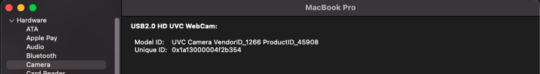
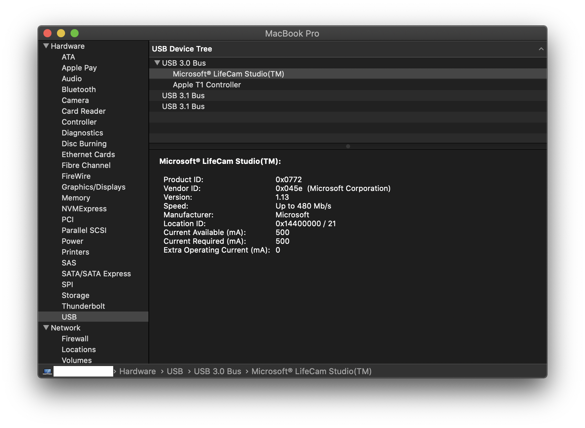

#  CameraControl for macOS

## Release notices:
For <b>macOS 10.15</b> or <b>newer</b>, you just open the <b>CameraControl app</b> in the <b>Application</b> folder or click the <b>CameraControl app</b> on <b>Launchpad</b> if <b>FaceTime</b> or any app would like to use the camera, but it can't access the camera. In addition, don't care about whether the <b>CameraControl app</b> is open or not. After that, go back to your app, and your camera will be working like you want.

    
p>

## Missing USB Kext
You could add USB kext to <b>Clover</b> bootloader or <b>OpenCore</b> bootloader in case you are missing device id.
[https://github.com/daliansky/OS-X-USB-Inject-All](https://github.com/daliansky/OS-X-USB-Inject-All)    

## Introducion and information from [@Charlie Powell](https://github.com/powellcj12) 
The CameraControl app and underlying UVCCameraControl code were originally made availabe by [@phoboslab](https://github.com/phoboslab). The project doesn't seem to be on GitHub, but was shared on the [phoboslab site here](https://phoboslab.org/log/2009/07/uvc-camera-control-for-mac-os-x). Notably, that project is from 2009 and many things about macOS development have changed since then. This project attempts to update the project to work on more recent version of macOS.

## macOS Changes
I had been using a verison of this app on 10.14 Mojave without issue but in 10.15 Catalina or newer Apple dropped support for 32-bit apps meaning that the QTKit framework the original project relies on is no longer available. AVFoundation is meant to be a replacement as documented by Apple in [TN2300](https://developer.apple.com/library/archive/technotes/tn2300/_index.html). That's the main work happening in this project. 

## Camera Support
While the app has a dropdown to switch between cameras, the UVCCameraControl created is based on the vendor and product IDs that can be found in System Information, currently set for the Microsoft LifeCam Studio(TM) that's motivating this project. Unless you're using this camera the settings almost certainly won't work, so until the logic there is generalized (tracked by #2) you'll need to manually update the code with the relevant values:

### Exposure Values
At least for the Microsoft LifeCam Studio(TM) sensor, there are apparently only specific values supported - these were obtained from the [CamHolderApp source](https://github.com/HBehrens/CamHolderApp) which is the app I was using previously. That app is also built from UVCCameraControl but has lots of other functionality that I didn't want to take the time to update since I'm really only interested in fixing the exposure settings (because that's what doesn't work well by default).  Eventually it might be worthwhile to incorporate that functionality here, tracked by #3.

## Thanks and reference links:
http://www.phoboslab.org/log/2009/07/uvc-camera-control-for-mac-os-x  
https://github.com/daliansky/OS-X-USB-Inject-All  
https://github.com/powellcj12/camera-control
